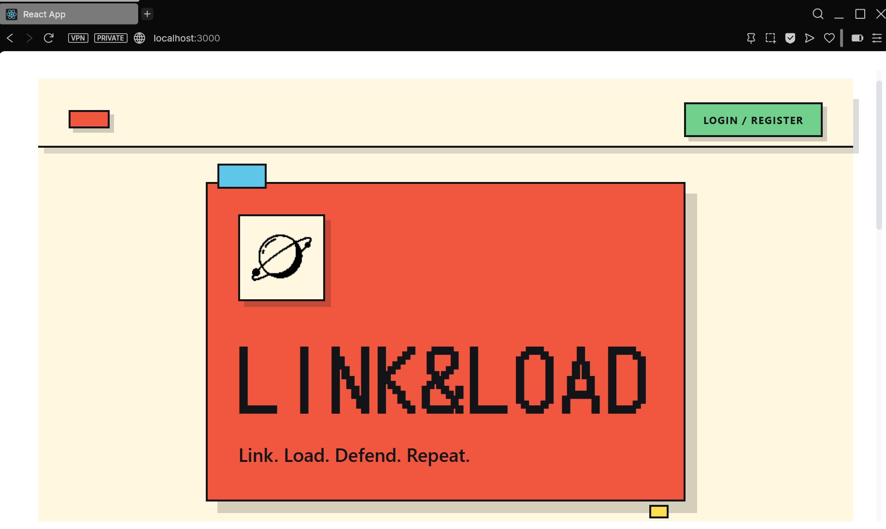
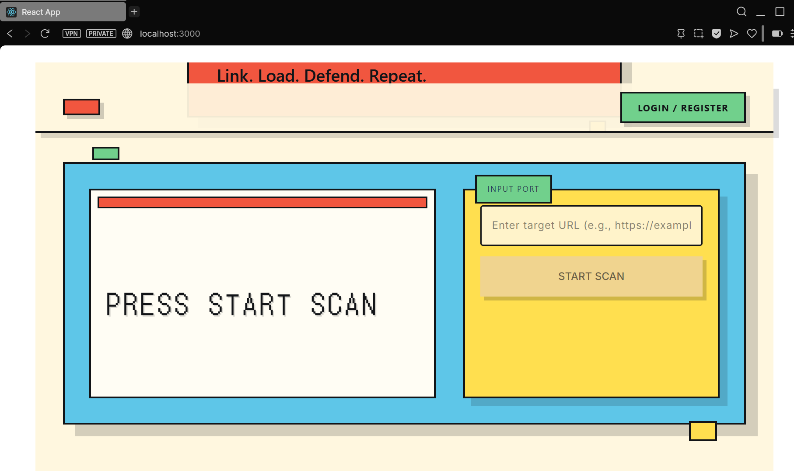
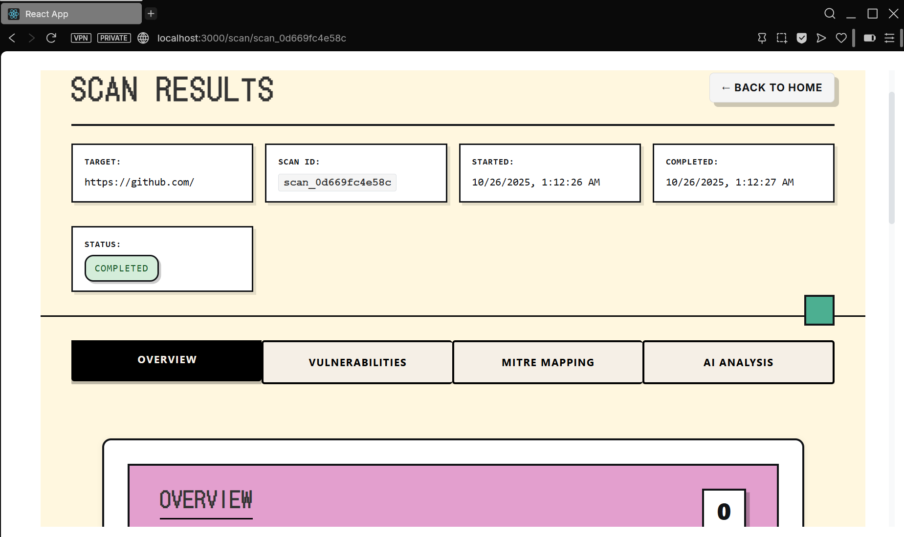

# Link&Load

> **AI-Powered Web Security Scanning Platform**

[](LICENSE)
[](https://www.python.org/)
[](https://fastapi.tiangolo.com/)
[](https://react.dev/)
[](https://www.docker.com/)

---

## Features

### Multi-Scanner Integration
- **OWASP ZAP** - Comprehensive web application scanning
- **Nuclei** - Template-based vulnerability detection  
- **Wapiti** - Black-box web application security scanner
- Concurrent execution for faster results

### AI-Powered Analysis
- **OpenAI GPT-4** or **Anthropic Claude** integration
- Intelligent vulnerability analysis
- Context-aware recommendations
- Fallback mechanism when LLM unavailable

### MITRE ATT&CK Mapping
- Automatic technique correlation
- Threat landscape understanding
- Tactic and technique classification
- Executive-ready reporting

### Risk Quantification
- 0-10 risk scoring algorithm
- Severity-based aggregation
- Business context awareness
- Compliance mapping

### Real-Time Updates
- WebSocket live progress tracking
- Instant result notifications
- Stage-by-stage visibility
- Connection resilience

### Professional UI
- Retro geometric design system
- Bold blocks with playful shadows
- Tabbed results dashboard
- Responsive design
- Game console-style interface

---

## Demo







---

## Quick Start

### Prerequisites
- Docker & Docker Compose (recommended)
- Or: Python 3.11+, Node.js 18+

### Development Setup

```bash
# Clone repository
git clone https://github.com/pratiyk/Link-Load.git
cd Link-Load

# Backend
cd backend
python -m venv .venv
source .venv/bin/activate  # Windows: .venv\Scripts\activate
pip install -r requirements.txt
python -m uvicorn app.main:app --reload

# Frontend (new terminal)
cd frontend
npm install
npm start

# Access
# Frontend: http://localhost:3000
# API Docs: http://localhost:8000/docs
```

### Production with Docker

```bash
# Copy environment file
cp .env.example .env
nano .env  # Configure settings

# Start all services
docker-compose up -d

# Initialize database
docker-compose exec backend alembic upgrade head

# Access
# Frontend: http://localhost:3000
# API: http://localhost:8000
```

---

## Architecture

```
┌─────────────────────┐
│   React Frontend    │
│  Home + Results     │
└──────────┬──────────┘
           │ REST/WS
┌──────────▼──────────┐
│   FastAPI Backend   │
│  Scan Orchestration │
└──────────┬──────────┘
      ┌────┼────┬─────────┐
      │    │    │         │
    OWASP ZAP Nuclei   Wapiti
      │    │    │         │
      └────┴────┴────┬────┘
          Vulnerabilities
           │         │
       LLM Service   DB
        (Analysis)
```

---

## API Endpoints

### Start Comprehensive Scan
```bash
POST /api/v1/scans/comprehensive/start
Content-Type: application/json

{
  "target_url": "https://example.com",
  "scan_types": ["owasp", "nuclei", "wapiti"],
  "options": {
    "enable_ai_analysis": true,
    "enable_mitre_mapping": true
  }
}

Response: { "scan_id": "scan_abc123..." }
```

### Get Scan Status
```bash
GET /api/v1/scans/comprehensive/{scan_id}/status
Response: { "status": "in_progress", "progress": 45 }
```

### Get Scan Results
```bash
GET /api/v1/scans/comprehensive/{scan_id}/result
Response: {
  "vulnerabilities": [...],
  "risk_assessment": {...},
  "mitre_mapping": [...],
  "ai_analysis": [...]
}
```

---

## Configuration

### Environment Variables

```bash
# Database
SUPABASE_URL=https://your-project.supabase.co
SUPABASE_KEY=your-anon-key

# Scanners
ZAP_URL=http://localhost:8090
NUCLEI_PATH=/usr/bin/nuclei
WAPITI_PATH=/usr/bin/wapiti

# LLM (choose one)
OPENAI_API_KEY=sk-...
ANTHROPIC_API_KEY=sk-ant-...

# Security
SECRET_KEY=your-secret-key
```

See [.env.example](./.env.example) for all options.

---

## Testing

```bash
# Health checks
python backend/health_check_services.py

# E2E tests
python backend/run_e2e_tests.py

# Unit tests
pytest backend/tests/
npm test --prefix frontend
```

---

## Tech Stack

### Backend
- **Framework:** FastAPI (Python 3.11)
- **Database:** Supabase (PostgreSQL)
- **Scanners:** OWASP ZAP, Nuclei, Wapiti
- **LLM:** OpenAI GPT-4, Anthropic Claude
- **Async:** asyncio, uvicorn

### Frontend
- **Framework:** React 18
- **Router:** React Router v6
- **HTTP:** Axios
- **Styling:** CSS3 with variables
- **WebSocket:** Native API

### DevOps
- **Containerization:** Docker
- **CI/CD:** GitHub Actions
- **Database:** PostgreSQL
- **Proxy:** Nginx

---

## Security

- JWT authentication
- CORS protection
- Rate limiting
- SQL injection prevention
- XSS protection
- SSL/TLS encryption
- Row-level security
- Secure password hashing
- **DNS TXT Record Verification** - Domain ownership validation

---

## DNS TXT Record Verification

### Overview

Link&Load implements **DNS TXT record verification** to ensure that only legitimate site owners can scan their domains and access scan results. This prevents unauthorized security scans and protects sensitive vulnerability data.

### Why DNS TXT Verification?

**Problem:** Without verification, anyone could:
- Scan any website without permission
- Access vulnerability reports for domains they don't own
- Abuse the scanning service for malicious reconnaissance

**Solution:** DNS TXT record verification requires domain control:
- Only domain owners or authorized admins can add DNS records
- Provides cryptographic proof of domain ownership
- Industry-standard approach (used by Google, Let's Encrypt, etc.)

### How It Works

```
┌─────────────┐         ┌──────────────┐         ┌─────────────┐
│   User      │         │  Link&Load   │         │  DNS Server │
│  (Owner)    │         │   Platform   │         │             │
└──────┬──────┘         └──────┬───────┘         └──────┬──────┘
       │                       │                        │
       │  1. Request Scan      │                        │
       ├──────────────────────>│                        │
       │                       │                        │
       │  2. Generate Token    │                        │
       │  <verification-token> │                        │
       │<──────────────────────┤                        │
       │                       │                        │
       │  3. Add DNS TXT       │                        │
       │  "linkload-verify=<token>"                     │
       ├───────────────────────┼───────────────────────>│
       │                       │                        │
       │  4. Confirm Added     │                        │
       ├──────────────────────>│                        │
       │                       │                        │
       │                       │  5. Query DNS TXT      │
       │                       ├───────────────────────>│
       │                       │                        │
       │                       │  6. Return TXT Record  │
       │                       │<───────────────────────┤
       │                       │                        │
       │  7. Verification OK   │                        │
       │  Scan Authorized ✓    │                        │
       │<──────────────────────┤                        │
```

### Implementation Guide

#### Step 1: Request Verification Token

**API Endpoint:**
```bash
POST /api/v1/scans/request-verification
Content-Type: application/json

{
  "domain": "example.com"
}

Response:
{
  "verification_token": "linkload-verify-a8f3e2b9c1d4",
  "dns_record": {
    "type": "TXT",
    "name": "_linkload-verify.example.com",
    "value": "linkload-verify-a8f3e2b9c1d4",
    "ttl": 300
  },
  "expires_at": "2025-11-03T18:30:00Z",
  "instructions": "Add the TXT record to your DNS settings"
}
```

#### Step 2: Add DNS TXT Record

**Option A: Using DNS Provider Dashboard (Most Common)**

1. Log in to your DNS provider (Cloudflare, GoDaddy, Namecheap, etc.)
2. Navigate to DNS Management for your domain
3. Add a new TXT record:
   - **Type:** TXT
   - **Name:** `_linkload-verify` or `_linkload-verify.example.com`
   - **Value:** `linkload-verify-a8f3e2b9c1d4`
   - **TTL:** 300 seconds (5 minutes)
4. Save changes

**Example - Cloudflare:**
```
Type: TXT
Name: _linkload-verify
Content: linkload-verify-a8f3e2b9c1d4
TTL: Auto
```

**Example - GoDaddy:**
```
Type: TXT
Host: _linkload-verify
TXT Value: linkload-verify-a8f3e2b9c1d4
TTL: 1 Hour
```

**Option B: Using Command Line (Advanced)**

```bash
# Check if DNS record exists
dig TXT _linkload-verify.example.com +short

# Alternative using nslookup
nslookup -type=TXT _linkload-verify.example.com

# Expected output:
"linkload-verify-a8f3e2b9c1d4"
```

#### Step 3: Verify Domain Ownership

**API Endpoint:**
```bash
POST /api/v1/scans/verify-domain
Content-Type: application/json

{
  "domain": "example.com",
  "verification_token": "linkload-verify-a8f3e2b9c1d4"
}

Response (Success):
{
  "verified": true,
  "domain": "example.com",
  "verified_at": "2025-11-03T17:45:00Z",
  "message": "Domain ownership verified successfully"
}

Response (Failure):
{
  "verified": false,
  "domain": "example.com",
  "error": "DNS TXT record not found or incorrect",
  "help": "Ensure the TXT record is properly configured and DNS has propagated (may take 5-30 minutes)"
}
```

#### Step 4: Start Authorized Scan

```bash
POST /api/v1/scans/comprehensive/start
Content-Type: application/json
Authorization: Bearer <your_jwt_token>

{
  "target_url": "https://example.com",
  "scan_types": ["owasp", "nuclei", "wapiti"],
  "options": {
    "enable_ai_analysis": true,
    "enable_mitre_mapping": true
  }
}

# Scan will only proceed if domain is verified
```

### Backend Implementation

#### Database Schema

```sql
-- Domain verification table
CREATE TABLE domain_verifications (
  id SERIAL PRIMARY KEY,
  domain VARCHAR(255) NOT NULL,
  verification_token VARCHAR(64) UNIQUE NOT NULL,
  verified BOOLEAN DEFAULT FALSE,
  verified_at TIMESTAMP,
  expires_at TIMESTAMP NOT NULL,
  created_at TIMESTAMP DEFAULT NOW(),
  user_id INTEGER REFERENCES users(id),
  UNIQUE(domain, user_id)
);

-- Index for fast lookups
CREATE INDEX idx_domain_verifications_token 
  ON domain_verifications(verification_token);
CREATE INDEX idx_domain_verifications_domain 
  ON domain_verifications(domain, verified);
```

#### Python Implementation

```python
# backend/app/services/domain_verification.py

import dns.resolver
import secrets
import hashlib
from datetime import datetime, timedelta
from typing import Optional, Dict, Any

class DomainVerificationService:
    """DNS TXT record verification service."""
    
    @staticmethod
    def generate_verification_token(domain: str) -> str:
        """Generate unique verification token."""
        random_part = secrets.token_hex(16)
        domain_hash = hashlib.sha256(domain.encode()).hexdigest()[:8]
        return f"linkload-verify-{random_part}-{domain_hash}"
    
    @staticmethod
    async def create_verification_request(
        domain: str, 
        user_id: int
    ) -> Dict[str, Any]:
        """Create verification request with token."""
        # Generate token
        token = DomainVerificationService.generate_verification_token(domain)
        
        # Create record in database
        verification = {
            "domain": domain,
            "verification_token": token,
            "verified": False,
            "expires_at": datetime.utcnow() + timedelta(hours=24),
            "user_id": user_id
        }
        
        # Store in database
        db.save_verification(verification)
        
        return {
            "verification_token": token,
            "dns_record": {
                "type": "TXT",
                "name": f"_linkload-verify.{domain}",
                "value": token,
                "ttl": 300
            },
            "expires_at": verification["expires_at"].isoformat(),
            "instructions": (
                f"Add TXT record '_linkload-verify.{domain}' "
                f"with value '{token}' to your DNS settings"
            )
        }
    
    @staticmethod
    async def verify_domain(
        domain: str, 
        verification_token: str
    ) -> Dict[str, Any]:
        """Verify domain ownership via DNS TXT lookup."""
        try:
            # Query DNS for TXT records
            txt_records = []
            resolver = dns.resolver.Resolver()
            resolver.timeout = 5
            resolver.lifetime = 10
            
            # Check subdomain record
            try:
                answers = resolver.resolve(
                    f"_linkload-verify.{domain}", 
                    "TXT"
                )
                for rdata in answers:
                    txt_records.extend([
                        s.decode() if isinstance(s, bytes) else s 
                        for s in rdata.strings
                    ])
            except dns.resolver.NXDOMAIN:
                # Try root domain
                answers = resolver.resolve(domain, "TXT")
                for rdata in answers:
                    txt_records.extend([
                        s.decode() if isinstance(s, bytes) else s 
                        for s in rdata.strings
                    ])
            
            # Check if verification token exists in TXT records
            found = verification_token in txt_records
            
            if found:
                # Update verification status in database
                db.update_verification(
                    verification_token,
                    {
                        "verified": True,
                        "verified_at": datetime.utcnow()
                    }
                )
                
                return {
                    "verified": True,
                    "domain": domain,
                    "verified_at": datetime.utcnow().isoformat(),
                    "message": "Domain ownership verified successfully"
                }
            else:
                return {
                    "verified": False,
                    "domain": domain,
                    "error": "DNS TXT record not found or incorrect",
                    "help": (
                        "Ensure the TXT record is properly configured "
                        "and DNS has propagated (may take 5-30 minutes)"
                    )
                }
        
        except dns.resolver.NoAnswer:
            return {
                "verified": False,
                "domain": domain,
                "error": "No TXT records found for domain",
                "help": "Add the TXT record to your DNS settings"
            }
        except dns.resolver.NXDOMAIN:
            return {
                "verified": False,
                "domain": domain,
                "error": "Domain does not exist",
                "help": "Verify the domain name is correct"
            }
        except Exception as e:
            return {
                "verified": False,
                "domain": domain,
                "error": f"DNS lookup failed: {str(e)}",
                "help": "Try again in a few minutes"
            }
    
    @staticmethod
    async def check_verification_status(
        domain: str, 
        user_id: int
    ) -> Optional[Dict[str, Any]]:
        """Check if domain is already verified for user."""
        verification = db.get_verification(domain, user_id)
        
        if not verification:
            return None
        
        # Check if expired
        if verification["expires_at"] < datetime.utcnow():
            return None
        
        return {
            "domain": domain,
            "verified": verification["verified"],
            "verified_at": verification.get("verified_at"),
            "expires_at": verification["expires_at"].isoformat()
        }
```

#### API Endpoints

```python
# backend/app/api/domain_verification.py

from fastapi import APIRouter, HTTPException, Depends
from app.services.domain_verification import DomainVerificationService
from app.core.security import get_current_user

router = APIRouter(
    prefix="/api/v1/verification",
    tags=["Domain Verification"]
)

@router.post("/request")
async def request_verification(
    request: dict,
    current_user = Depends(get_current_user)
):
    """Request domain verification token."""
    domain = request.get("domain")
    if not domain:
        raise HTTPException(400, "Domain is required")
    
    result = await DomainVerificationService.create_verification_request(
        domain=domain,
        user_id=current_user.id
    )
    
    return result

@router.post("/verify")
async def verify_domain(
    request: dict,
    current_user = Depends(get_current_user)
):
    """Verify domain ownership."""
    domain = request.get("domain")
    token = request.get("verification_token")
    
    if not domain or not token:
        raise HTTPException(400, "Domain and token are required")
    
    result = await DomainVerificationService.verify_domain(
        domain=domain,
        verification_token=token
    )
    
    return result

@router.get("/status/{domain}")
async def check_status(
    domain: str,
    current_user = Depends(get_current_user)
):
    """Check verification status."""
    status = await DomainVerificationService.check_verification_status(
        domain=domain,
        user_id=current_user.id
    )
    
    if not status:
        raise HTTPException(404, "No verification found")
    
    return status
```

### Frontend Integration

#### React Component

```jsx
// frontend/src/components/DomainVerification.jsx

import React, { useState } from 'react';
import axios from 'axios';

const DomainVerification = ({ domain, onVerified }) => {
  const [step, setStep] = useState('request'); // request, pending, verified
  const [verificationData, setVerificationData] = useState(null);
  const [error, setError] = useState(null);
  const [checking, setChecking] = useState(false);

  const requestVerification = async () => {
    try {
      const response = await axios.post('/api/v1/verification/request', {
        domain: domain
      });
      setVerificationData(response.data);
      setStep('pending');
    } catch (err) {
      setError(err.response?.data?.detail || 'Failed to request verification');
    }
  };

  const verifyDomain = async () => {
    setChecking(true);
    try {
      const response = await axios.post('/api/v1/verification/verify', {
        domain: domain,
        verification_token: verificationData.verification_token
      });
      
      if (response.data.verified) {
        setStep('verified');
        onVerified && onVerified(domain);
      } else {
        setError(response.data.error || 'Verification failed');
      }
    } catch (err) {
      setError(err.response?.data?.detail || 'Verification failed');
    } finally {
      setChecking(false);
    }
  };

  const copyToClipboard = (text) => {
    navigator.clipboard.writeText(text);
  };

  return (
    <div className="domain-verification">
      {step === 'request' && (
        <div className="verification-step">
          <h3>Verify Domain Ownership</h3>
          <p>To scan <strong>{domain}</strong>, you must prove you own it.</p>
          <button onClick={requestVerification}>
            Request Verification
          </button>
        </div>
      )}

      {step === 'pending' && verificationData && (
        <div className="verification-step">
          <h3>Add DNS TXT Record</h3>
          <div className="verification-instructions">
            <p>Add this TXT record to your DNS settings:</p>
            
            <div className="dns-record">
              <div className="record-field">
                <label>Type:</label>
                <span>TXT</span>
              </div>
              <div className="record-field">
                <label>Name:</label>
                <span>{verificationData.dns_record.name}</span>
                <button onClick={() => copyToClipboard(verificationData.dns_record.name)}>
                  Copy
                </button>
              </div>
              <div className="record-field">
                <label>Value:</label>
                <code>{verificationData.dns_record.value}</code>
                <button onClick={() => copyToClipboard(verificationData.dns_record.value)}>
                  Copy
                </button>
              </div>
            </div>

            <div className="help-text">
              <h4>How to add DNS record:</h4>
              <ol>
                <li>Log in to your DNS provider (Cloudflare, GoDaddy, etc.)</li>
                <li>Go to DNS Management for {domain}</li>
                <li>Add a new TXT record with the values above</li>
                <li>Wait 5-10 minutes for DNS propagation</li>
                <li>Click "Verify" below</li>
              </ol>
            </div>

            {error && <div className="error">{error}</div>}

            <button onClick={verifyDomain} disabled={checking}>
              {checking ? 'Checking DNS...' : 'Verify Domain'}
            </button>
          </div>
        </div>
      )}

      {step === 'verified' && (
        <div className="verification-step success">
          <h3>✓ Domain Verified!</h3>
          <p>You can now scan <strong>{domain}</strong></p>
        </div>
      )}
    </div>
  );
};

export default DomainVerification;
```

### Security Best Practices

1. **Token Expiration**: Verification tokens expire after 24 hours
2. **Rate Limiting**: Limit verification requests to prevent abuse
3. **One-Time Use**: Tokens are invalidated after successful verification
4. **User Association**: Verifications are tied to user accounts
5. **HTTPS Only**: All verification endpoints require HTTPS
6. **DNS Validation**: Use multiple DNS servers for redundancy

### Dependencies

```bash
# Backend
pip install dnspython>=2.4.0

# Add to requirements.txt
dnspython>=2.4.0
```

### Testing

```bash
# Test DNS lookup
python -c "
import dns.resolver
resolver = dns.resolver.Resolver()
answers = resolver.resolve('_linkload-verify.example.com', 'TXT')
for rdata in answers:
    print(rdata.strings)
"

# Test with dig
dig TXT _linkload-verify.example.com

# Test with nslookup
nslookup -type=TXT _linkload-verify.example.com
```

### Common Issues & Solutions

**Issue:** DNS record not found immediately
- **Solution:** DNS propagation takes 5-30 minutes. Wait and retry.

**Issue:** Multiple TXT records on same domain
- **Solution:** Platform checks all TXT records for the verification token.

**Issue:** Subdomain verification
- **Solution:** Add TXT record for `_linkload-verify.subdomain.example.com`

**Issue:** Wildcard domain verification
- **Solution:** Verify the apex domain; scans allowed for all subdomains.

### Alternative Verification Methods

While DNS TXT is recommended, consider these alternatives:

1. **HTML Meta Tag**: Add `<meta name="linkload-verify" content="token">` to homepage
2. **File Upload**: Upload `linkload-verify.txt` to webroot
3. **HTTP Header**: Return `X-LinkLoad-Verify: token` header

---

## Project Status

**Status:**  **PRODUCTION READY**

### Implementation Complete
- 8 Backend API endpoints
- 3 Integrated scanners
- 2 LLM providers (+ fallback)
- Professional UI
- Docker containerization
- CI/CD pipelines
- Production deployment
- Complete documentation

---

## Troubleshooting

### Backend won't start
```bash
docker-compose logs backend
docker-compose up --build
```

### Frontend connection issues
- Check backend: `http://localhost:8000/docs`
- Verify CORS settings
- Check API URL in environment

### Scanner issues
```bash
python backend/health_check_services.py
```

---

## Contributing

Contributions welcome! Please:

1. Fork the repository
2. Create a feature branch
3. Make your changes
4. Add tests
5. Submit a pull request

---

## License

MIT License - see [LICENSE](LICENSE) for details.

---

## Author

**Prateek Shrivastava** ([@pratiyk](https://github.com/pratiyk))

---

## Support

For issues, features, or questions:
- Open [GitHub Issue](https://github.com/pratiyk/Link-Load/issues)
- Check [Documentation](./SETUP_AND_CONFIG.md)
- Review [Project Status](./PROJECT_COMPLETION_SUMMARY.md)

---

**Built with ❤️ for web security**

Latest Update: October 26, 2025 | Version: 1.0.0 | Status: Production Ready
