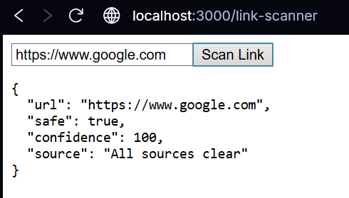

# Link&Load
## Lock, stock, and two smoking bad URLs.
A modular cybersecurity platform for scanning malicious links, monitoring threats, and integrating secure-by-design practices in applications.
Link & Load helps developers, analysts, and small businesses stay ahead of cyber threats by offering a security-first, plug-and-play system that integrates:
- Malicious URL detection
- Threat intelligence aggregation
- Secure API-first architecture
- Audit-friendly reporting (coming soon)

### Use Cases:
- Scan suspicious links before opening (Phishing & Malware Prevention)
- Integrate into internal tools for link safety assurance
- Cyber awareness training for non-technical teams
- Lightweight toolkit for Red/Blue team ops (e.g., during CTFs)
- Security layer for customer-facing apps

### Core features:
- URL reputation checker (API integration)
- Basic header security scanner
- Vulnerability dashboard

### Setup & Usage:
```
# Clone
git clone https://github.com/yourusername/link-load
cd link-load

# Backend
cd backend
pip install -r requirements.txt
uvicorn main:app --reload --port 8000

# Frontend
cd ../frontend
npm install
npm start

```
***
#### 13-06-2025
The Link Scanner module is now fully implemented. This feature allows users to input a URL and receive a consolidated threat analysis report based on multiple cybersecurity APIs. It helps detect malicious links, phishing URLs, and suspicious activity before interacting with the site.

######  How it Works:
 - The frontend takes a URL input from the user.
 - It sends the URL to the backend using a POST request.
 - The backend then queries multiple APIs to scan the link:
   - Google Safe Browsing API for malware/phishing detection.
   - VirusTotal API for detailed file/URL analysis.
   - PhishTank API for crowdsourced phishing detection.
 - The results from all three sources are returned and displayed in a clean, formatted JSON view on the frontend.

   ***
#### 15-06-2025
I have successfully implemented the Threat Score Aggregator module. This new feature enhances the project’s cybersecurity capabilities by aggregating threat intelligence from multiple external APIs to assess the risk associated with a domain or IP address.

######  How it Works: 
 - The user inputs a domain or IP address in the frontend React app.
 - The input is sent to the backend FastAPI server.
 - The backend queries three key cybersecurity services:
   - VirusTotal API: Provides analysis of domain reputation and detects malicious activity.
   - AbuseIPDB API: Offers insights on IP address abuse history and confidence scores.
   - Shodan API: Retrieves detailed information about the IP’s open ports, services, and vulnerabilities.
 - The backend processes and aggregates this data, classifying the overall risk level (High, Medium, or Low).
 - The frontend displays the detailed report and risk classification in a user-friendly format.

***
#### 17-06-2025
The Vulnerability Scanner module is now fully implemented, providing a seamless way to scan software packages for known security vulnerabilities by querying multiple trusted vulnerability databases. It integrates a React frontend user interface with a FastAPI backend API, combining data from OSV.dev and the National Vulnerability Database (NVD) to deliver comprehensive vulnerability reports.

######  How it Works: 
- The user inputs a package name, selects its ecosystem, and optionally enters a version in the React frontend.
- The frontend sends this data via POST request to the FastAPI backend /api/scan-vulnerabilities endpoint.
- The backend queries two key vulnerability data sources:
   - OSV.dev API: Retrieves vulnerability info for the given package and version.
   - NVD API: Searches for related CVE entries based on the package name.
- The backend processes and merges results from both sources, formatting details like vulnerability ID, summary, severity, affected versions, and data source.
- The aggregated vulnerability data is returned to the frontend.
- The frontend displays a user-friendly list of vulnerabilities, including severity and affected versions, with loading and error handling.


