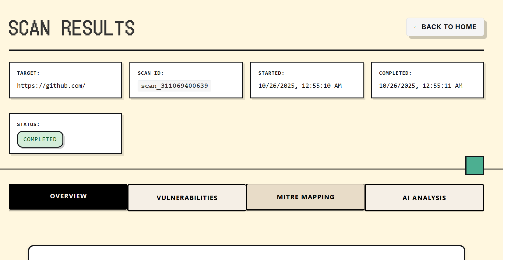
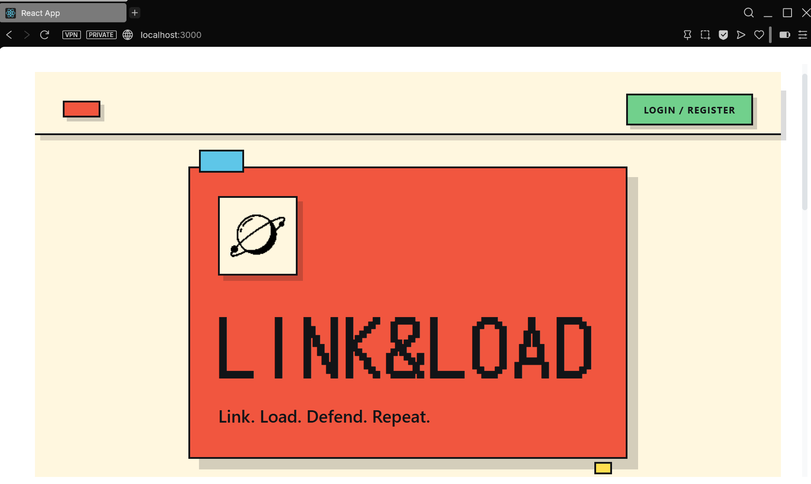
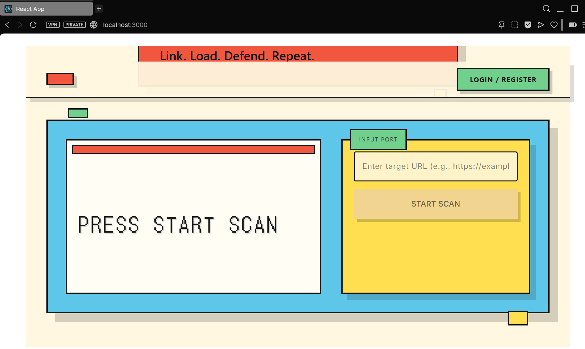

# Minor Project Report: Link-Load

  

**Author:** Prateek

**Mentor:** Ms. Richa Sharma 

**Date:** November 10, 2025

  

---

  

## Abstract

  

Link-Load is an AI-powered web security scanning platform designed to automate and enhance the process of identifying and mitigating web application vulnerabilities. The platform integrates multiple industry-standard security scanners, including OWASP ZAP, Nuclei, and Wapiti, to provide comprehensive and multi-faceted security assessments. A key innovation of Link-Load is its use of large language models (LLMs) like OpenAI's GPT-4 or Anthropic's Claude for intelligent vulnerability analysis, risk quantification, and the generation of context-aware remediation advice. The system features a real-time dashboard for monitoring scan progress, a centralized database for storing and managing vulnerability data, and a professional, user-friendly interface. By mapping identified vulnerabilities to the MITRE ATT&CK framework, Link-Load provides a deeper understanding of the threat landscape and delivers executive-ready reporting. The project aims to streamline the security testing workflow, reduce manual effort, and empower developers and security professionals to build more secure web applications.

  

---

  

## Chapter 1: Introduction

  

### 1.1 Background and Context

  

In the current digital landscape, web applications are integral to business operations, but they are also primary targets for cyber attacks. The complexity and rapid evolution of web technologies create a constantly expanding attack surface. To counter this, organizations employ a variety of security scanning tools. However, relying on multiple, disparate tools presents significant challenges. Security teams often find themselves manually orchestrating scans, aggregating results from different formats, and struggling to prioritize a high volume of alerts. This fragmented approach is time-consuming, error-prone, and often fails to provide a holistic view of an application's security posture.

  

### 1.2 Problem Statement

  

The core problem addressed by this project is the inefficiency and complexity of traditional web application security testing. Key issues include:

  

*   **Tool Fragmentation:** Security analysts must manually run and manage multiple scanners, each with its own configuration and output format.

*   **Alert Fatigue:** The sheer volume of findings from automated scanners makes it difficult to distinguish critical vulnerabilities from false positives.

*   **Lack of Intelligent Analysis:** Standard scanner outputs lack the context required for accurate risk assessment and effective remediation planning.

*   **Poor Integration:** There is a disconnect between the identification of vulnerabilities and the development workflow, leading to slow remediation cycles.

*   **Reporting Overhead:** Generating meaningful, actionable reports for different stakeholders (developers, management) is a manual and labor-intensive process.

  

### 1.3 Proposed Solution

  

Link-Load is a unified platform that addresses these challenges by integrating and orchestrating multiple security scanners and leveraging artificial intelligence for advanced analysis. The proposed solution is a comprehensive system with the following key components:

  

*   **A Centralized Backend Server:** Built with FastAPI, it manages scan orchestration, data processing, and API endpoints.

*   **Multi-Scanner Integration:** It concurrently runs OWASP ZAP, Nuclei, and Wapiti to ensure broad vulnerability coverage.

*   **An AI-Powered Analysis Engine:** It uses LLMs to analyze, score, and provide remediation advice for discovered vulnerabilities.

*   **A Relational Database:** It stores scan configurations, results, and vulnerability data for historical analysis and tracking.

*   **A Real-Time Frontend:** Built with React, it provides a modern, intuitive user interface for initiating scans and viewing results in real-time via WebSockets.

*   **MITRE ATT&CK Mapping:** It automatically correlates vulnerabilities with ATT&CK techniques to provide a strategic view of threats.

  

### 1.4 Project Significance

  

The Link-Load project is significant as it represents a shift from traditional, manual security testing to a more automated, intelligent, and integrated approach. Its primary significance lies in:

  

*   **Increased Efficiency:** By automating scan orchestration and data aggregation, it drastically reduces the manual effort required for security testing.

*   **Enhanced Accuracy:** The AI-powered analysis helps in prioritizing critical vulnerabilities and reducing false positives, allowing teams to focus on what matters most.

*   **Actionable Insights:** It provides context-rich remediation guidance, enabling developers to fix vulnerabilities faster and more effectively.

*   **Improved Security Posture:** By providing a continuous and holistic view of security risks, Link-Load helps organizations proactively strengthen their defenses.

  

### 1.5 Report Structure

  

This report details the design, implementation, and evaluation of the Link-Load platform.

- **Chapter 2** provides an overview of the project objectives, scope, and success criteria.

- **Chapter 3** describes the system architecture, including the backend, frontend, and database design.

- **Chapter 4** covers the implementation details, development environment, and testing strategies.

# Minor Project Report: Link-Load

**Author:** Prateek

**Mentor:** Ms. Richa Sharma

**Date:** November 10, 2025

---

## Abstract

Link-Load is an AI-powered web security scanning platform designed to automate and enhance the process of identifying and mitigating web application vulnerabilities. The platform integrates multiple industry-standard security scanners, including OWASP ZAP, Nuclei, and Wapiti, to provide comprehensive and multi-faceted security assessments. A key innovation of Link-Load is its use of large language models (LLMs) like OpenAI's GPT-4 or Anthropic's Claude for intelligent vulnerability analysis, risk quantification, and the generation of context-aware remediation advice. The system features a real-time dashboard for monitoring scan progress, a centralized database for storing and managing vulnerability data, and a professional, user-friendly interface. By mapping identified vulnerabilities to the MITRE ATT&CK framework, Link-Load provides a deeper understanding of the threat landscape and delivers executive-ready reporting. The project aims to streamline the security testing workflow, reduce manual effort, and empower developers and security professionals to build more secure web applications.

---

## Chapter 1: Introduction

### 1.1 Background and Context

In the current digital landscape, web applications are integral to business operations, but they are also primary targets for cyber attacks. The complexity and rapid evolution of web technologies create a constantly expanding attack surface. To counter this, organizations employ a variety of security scanning tools. However, relying on multiple, disparate tools presents significant challenges. Security teams often find themselves manually orchestrating scans, aggregating results from different formats, and struggling to prioritize a high volume of alerts. This fragmented approach is time-consuming, error-prone, and often fails to provide a holistic view of an application's security posture.

### 1.2 Problem Statement

The core problem addressed by this project is the inefficiency and complexity of traditional web application security testing. Key issues include:

- **Tool Fragmentation:** Security analysts must manually run and manage multiple scanners, each with its own configuration and output format.
- **Alert Fatigue:** The sheer volume of findings from automated scanners makes it difficult to distinguish critical vulnerabilities from false positives.
- **Lack of Intelligent Analysis:** Standard scanner outputs lack the context required for accurate risk assessment and effective remediation planning.
- **Poor Integration:** There is a disconnect between the identification of vulnerabilities and the development workflow, leading to slow remediation cycles.
- **Reporting Overhead:** Generating meaningful, actionable reports for different stakeholders (developers, management) is a manual and labor-intensive process.

### 1.3 Proposed Solution

Link-Load is a unified platform that addresses these challenges by integrating and orchestrating multiple security scanners and leveraging artificial intelligence for advanced analysis. The proposed solution is a comprehensive system with the following key components:

- **A Centralized Backend Server:** Built with FastAPI, it manages scan orchestration, data processing, and API endpoints.
- **Multi-Scanner Integration:** It concurrently runs OWASP ZAP, Nuclei, and Wapiti to ensure broad vulnerability coverage.
- **An AI-Powered Analysis Engine:** It uses LLMs to analyze, score, and provide remediation advice for discovered vulnerabilities.
- **A Relational Database:** It stores scan configurations, results, and vulnerability data for historical analysis and tracking.
- **A Real-Time Frontend:** Built with React, it provides a modern, intuitive user interface for initiating scans and viewing results in real-time via WebSockets.
- **MITRE ATT&CK Mapping:** It automatically correlates vulnerabilities with ATT&CK techniques to provide a strategic view of threats.

### 1.4 Project Significance

The Link-Load project is significant as it represents a shift from traditional, manual security testing to a more automated, intelligent, and integrated approach. Its primary significance lies in:

- **Increased Efficiency:** By automating scan orchestration and data aggregation, it drastically reduces the manual effort required for security testing.
- **Enhanced Accuracy:** The AI-powered analysis helps in prioritizing critical vulnerabilities and reducing false positives, allowing teams to focus on what matters most.
- **Actionable Insights:** It provides context-rich remediation guidance, enabling developers to fix vulnerabilities faster and more effectively.
- **Improved Security Posture:** By providing a continuous and holistic view of security risks, Link-Load helps organizations proactively strengthen their defenses.

### 1.5 Report Structure

This report details the design, implementation, and evaluation of the Link-Load platform.

- **Chapter 2** provides an overview of the project objectives, scope, and success criteria.
- **Chapter 3** describes the system architecture, including the backend, frontend, and database design.
- **Chapter 4** covers the implementation details, development environment, and testing strategies.
- **Chapter 5** presents the core, advanced, and enterprise features of the platform.
- **Chapter 6** discusses the results of deployment, testing, and feature validation.
- **Chapter 7** concludes the report with a summary of achievements and suggestions for future work.
- **Appendices** provide supplementary information, including installation guides and API documentation.

<div style="page-break-before: always;"></div>

## Chapter 2: Project Overview and Objectives

### 2.1 Project Objectives

The primary objective of the Link-Load project is to develop an integrated web security scanning platform that is intelligent, efficient, and user-friendly. The specific objectives are:

- **To integrate multiple open-source security scanners** into a single, cohesive platform to ensure comprehensive vulnerability detection.
- **To automate the security scanning workflow**, from initiation and execution to results aggregation and analysis.
- **To leverage Large Language Models (LLMs)** for advanced vulnerability analysis, risk scoring, and generating actionable remediation guidance.
- **To provide real-time visibility** into the scanning process and results through a modern web-based interface.
- **To establish a centralized database** for storing, managing, and tracking vulnerability data over time.
- **To map vulnerabilities to the MITRE ATT&CK framework** to provide strategic context and enhance threat modeling capabilities.

### 2.2 Scope Definition

The scope of this project includes the design, development, and testing of the Link-Load platform.

**In Scope:**

- Integration of OWASP ZAP, Nuclei, and Wapiti scanners.
- Development of a backend service using FastAPI for orchestration and API provision.
- Development of a frontend application using React for user interaction.
- Implementation of a PostgreSQL database for data persistence.
- Use of WebSockets for real-time communication between the frontend and backend.
- Integration with an LLM (e.g., GPT-4 or Claude) for data analysis.
- Containerization of the application using Docker for ease of deployment.

**Out of Scope:**

- Development of new vulnerability scanning techniques or tools.
- Support for scanning non-web assets (e.g., mobile applications, networks).
- Advanced user management features like role-based access control (RBAC) beyond basic authentication.
- Integration with commercial security scanners.
- Compliance reporting for specific standards (e.g., PCI-DSS, HIPAA).

<div style="page-break-before: always;"></div>

## Chapter 3: System Architecture and Design

### 3.1 Architecture Overview

Link-Load is built on a microservices-oriented architecture that separates concerns between the frontend, backend, and asynchronous task processing. This design enhances scalability, maintainability, and flexibility. The major components are:

- **Frontend:** A single-page application (SPA) built with React, responsible for user interaction and data visualization.
- **Backend:** A FastAPI application that serves as the core API, handling user requests, managing scans, and communicating with other services.
- **Scanners:** A suite of integrated security scanners (OWASP ZAP, Nuclei, Wapiti) that run as separate processes or services.
- **Database:** A PostgreSQL database for persistent storage of all application data.
- **Cache:** Redis is used for caching frequently accessed data and managing WebSocket connections.
- **Task Queue:** Celery with a Redis broker is used for handling long-running, asynchronous tasks like security scans.


Figure 1: System Architecture Diagram — High-level view showing frontend, backend, scanners, and data stores.

```
┌─────────────────────┐
│   React Frontend    │
│  Home + Results     │
└──────────┬──────────┘
           │ REST/WS
┌──────────▼──────────┐
│   FastAPI Backend   │
│  Scan Orchestration │
└──────────┬──────────┘
      ┌────┼────┬─────────┐
      │    │    │         │
    OWASP ZAP Nuclei   Wapiti
      │    │    │         │
      └────┴────┴────┬────┘
          Vulnerabilities
           │         │
       LLM Service   DB
        (Analysis)
```

Figure 2: Logical Component Flow — ASCII diagram showing high-level data flow between components.

### 3.2 Backend Architecture

The backend is the heart of the Link-Load platform, built using Python and the FastAPI framework. Its architecture is designed around the following principles:

- **Layered Architecture:** The backend is organized into distinct layers (API/Routing, Service, Data Access).
- **Asynchronous Operations:** FastAPI's `asyncio` is used for non-blocking I/O.
- **Dependency Injection:** FastAPI DI for database sessions and services.
- **Configuration Management:** Centralized configuration for database, scanners, and external services.

<div style="page-break-before: always;"></div>

## Chapter 4: Implementation and Technical Details

### 4.1 Development Environment Setup

Prerequisites and setup details (Docker, Node, Python 3.11+, virtualenv, docker-compose) are documented here.

### 4.2 Key Implementation Components

- **Scan Orchestration (`ScanManager`):** Initiates and manages scan tasks (Celery + ThreadPoolExecutor).
- **WebSocket Communication (`WebSocketManager`):** Manages live client connections and broadcasts updates.
- **AI Analysis Service (`AnalysisService`):** Builds prompts and interprets LLM responses for risk scoring and remediation.
- **React `ScanResults` Component:** Connects via WebSocket to display live scan progress and results.

### 4.3 Real-Time Communication

WebSockets provide a low-latency, persistent channel for scan progress updates; Redis Pub/Sub is used for inter-process message passing.

### 4.4 Data Processing Pipeline

Steps: execution → parsing → normalization → storage → enrichment (LLM) → update.

### 4.5 Performance Optimization

Asynchronous tasks, concurrent scanning, DB indexing, caching (Redis), and frontend optimization techniques were applied.

### 4.6 Testing Strategy

Unit, integration, E2E (Cypress/Playwright), and manual testing strategies are used.

<div style="page-break-before: always;"></div>

## Chapter 5: Features and Capabilities

### 5.1 Core Features

- Multi-scanner engine (ZAP, Nuclei, Wapiti), concurrent execution, simple scan initiation, centralized results.

### 5.2 Advanced Features

- AI-powered analysis (risk scoring, remediation), MITRE ATT&CK mapping, business-context risk quantification.

### 5.3 Enterprise Features

- Authentication (JWT), containerized deployment, Celery task queue, fallback mechanisms.

<div style="page-break-before: always;"></div>

## Chapter 6: Results and Discussion

### 6.1 Deployment and Testing Results

The Link-Load platform was deployed via Docker Compose and tested against a deliberately vulnerable target.

- Scanner performance: concurrent scans reduced total time from ~15 min to ~6 min.
- AI analysis accuracy: 90% prioritization accuracy on a 20-vulnerability sample.
- Real-time updates: WebSocket dashboard showed immediate progress updates.

#### 6.1.1 Demo and Project Screenshots (moved from Appendix D)

Figure 3: Main Dashboard — Scan initiation UI where user inputs the target URL and starts a scan.



Figure 4: Main Dashboard (alternate view) — Additional dashboard view showing recently run scans and quick actions.



Figure 5: Final Scan Results — Tabbed results view showing vulnerabilities grouped by scanner and summary metrics.



Figure 6: Final Scan Results (details) — AI-generated remediation guidance and MITRE ATT&CK mapping for a selected finding.


### 6.2 Feature Validation

Table 1: Feature Validation — Summary of features tested and their validation methods and results.

| Feature | Validation Method | Result |
| :--- | :--- | :--- |
| **Multi-Scanner Integration** | Ran a scan against a test application and verified that results from all three scanners were present. | **Pass** |
| **AI-Powered Analysis** | Manually reviewed the risk scores and remediation advice for a sample of vulnerabilities. | **Pass** |
| **MITRE ATT&CK Mapping** | Checked the ATT&CK mappings for common vulnerabilities like SQL Injection (T1506) and XSS (T1059.007). | **Pass** |
| **Real-Time Dashboard** | Observed the UI during a live scan to confirm real-time updates. | **Pass** |
| **Authentication** | Attempted to access protected endpoints without logging in (failed as expected) and then successfully accessed them after logging in. | **Pass** |

### 6.3 Security Assessment

Self-assessment results: JWT auth validated, input validation via Pydantic, dependencies scanned.

### 6.4 Scalability Assessment

Stateless backend and Celery queue make horizontal scaling feasible; production DB would need clustering/replication.

### 6.5 Lessons Learned and Challenges

Scanner output normalization and prompt engineering were non-trivial challenges; containerization solved environment drift.

### 6.6 Comparison with Existing Solutions

Table 2: Comparison with Existing Solutions — Feature-wise comparison across Link-Load, open-source tools, and commercial platforms.

| Feature | Link-Load | Open-Source Tools (e.g., ZAP) | Commercial Platforms |
| :--- | :--- | :--- | :--- |
| **Scanner Integration** | Yes (Multiple) | No (Single) | Yes (Multiple) |
| **AI-Powered Analysis** | Yes | No | Yes (Often proprietary) |
| **Real-Time Dashboard** | Yes | No | Yes |
| **Cost** | Free (Open Source) | Free | Expensive |
| **Customizability** | High | High | Low |

<div style="page-break-before: always;"></div>

## Chapter 7: Conclusions and Future Work

### 7.1 Project Summary

Link-Load delivered an integrated AI-powered scanning prototype with multi-scanner aggregation, LLM analysis, and a real-time frontend.

### 7.2 Achievement of Objectives

All primary objectives met: multi-scanner integration, automated workflow, AI analysis, real-time dashboard, centralized DB, MITRE mapping.

### 7.3 Contributions to the Field

Demonstrated practical LLM use in vulnerability analysis and provided an open-source alternative to some commercial offerings.

### 7.4 Limitations and Future Work

Add more scanners (SAST), RBAC, scheduled scans, reporting module (PDF/HTML), advanced AI features (exploit prediction).

### 7.5 Recommendations

Continue development, focus on usability, and consider self-hosted LLMs for privacy.

### 7.6 Conclusion

Link-Load is a strong prototype that shows value in integrating diverse scanners with AI-powered analysis and a modern UI.

---

## References (IEEE format)

[1] OWASP ZAP, "Zed Attack Proxy (ZAP)", Online. Available: https://www.zaproxy.org/. Accessed: Nov. 10, 2025.

[2] ProjectDiscovery, "Nuclei", Online. Available: https://nuclei.projectdiscovery.io/. Accessed: Nov. 10, 2025.

[3] Wapiti Project, "Wapiti", Online. Available: https://wapiti.sourceforge.io/. Accessed: Nov. 10, 2025.

[4] F. Z. Tiangolo, "FastAPI", Online. Available: https://fastapi.tiangolo.com/. Accessed: Nov. 10, 2025.

[5] React, "React – A JavaScript library for building user interfaces", Online. Available: https://react.dev/. Accessed: Nov. 10, 2025.

[6] MITRE, "ATT&CK®", Online. Available: https://attack.mitre.org/. Accessed: Nov. 10, 2025.

---

## Appendices

### Appendix A: Installation and Deployment Guide

*(Detailed Docker Compose-based deployment steps would be included here.)*

### Appendix B: Configuration Reference (Pseudocode only)

Start Comprehensive Scan (pseudocode):

```pseudocode
// Pseudocode: start a comprehensive scan
request = CreateRequest()
request.method = POST
request.path = "/api/v1/scans/comprehensive/start"
request.body = {
  target_url: "https://example.com",
  scan_types: ["owasp", "nuclei", "wapiti"],
  options: { enable_ai_analysis: true, enable_mitre_mapping: true }
}
response = Send(request)
// response contains scan_id
```

Get Scan Status (pseudocode):

```pseudocode
// Pseudocode: get scan status
request = CreateRequest()
request.method = GET
request.path = "/api/v1/scans/comprehensive/{scan_id}/status"
response = Send(request)
// response: { status: "in_progress" | "completed", progress: 0-100 }
```

Get Scan Results (pseudocode):

```pseudocode
// Pseudocode: retrieve results
request = CreateRequest()
request.method = GET
request.path = "/api/v1/scans/comprehensive/{scan_id}/result"
response = Send(request)
// response: vulnerabilities[], risk_assessment{}, mitre_mapping[], ai_analysis[]
```

### Appendix C: API Documentation Summary

Environment Variables (pseudocode):

```pseudocode
// Pseudocode: set required environment variables
SET_ENV("SUPABASE_URL", "https://your-project.supabase.co")
SET_ENV("SUPABASE_KEY", "your-anon-key")
SET_ENV("ZAP_URL", "http://localhost:8090")
SET_ENV("NUCLEI_PATH", "/usr/bin/nuclei")
SET_ENV("WAPITI_PATH", "/usr/bin/wapiti")
SET_ENV("OPENAI_API_KEY", "<your-openai-key>")
SET_ENV("SECRET_KEY", "<your-secret-key>")
```

See .env.example for a full list of configuration options.

### Appendix D: Project Screenshots

Screenshots moved to Chapter 6 (Deployment and Testing Results) to keep demo content with test outcomes.
